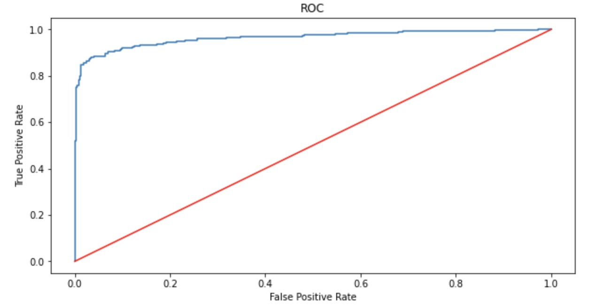

  

# IBM HR Analytics Employee Attrition
## Project Summary
With the rise of Data Science over the past few years, companies are finding more ways to apply machine learning methods internally. One such way is People Analytics. People Analytics is a data driven way for companies to better understand and manage their employees. It comes as no surprise that IBM is one company that focuses on People Analytics. The focus of this project was on figuring out what causes IBM employees to feel attrited and to create a predictive model that classifies attrited employees. 

## Data
The dataset used for this project comes from [Kaggle](https://www.kaggle.com/pavansubhasht/ibm-hr-analytics-attrition-dataset), but originally provided by IBM Data Scientists for research purposes.

## Project Breakdown
The main files for this project can be found under `notebooks`:

- `1_data_wrangling.ipynb`: 
   - Loaded the raw data, doing some basic inspections for data types and null values, and saving it as a usable file.
   
- `2_eda.ipynb`:
   - An in depth analysis of the data to understand feature distributions and understand what what features might be the most critical in classifiying emlpoyees. Histograms were created to visualize distributions, correlation heatmaps were made to see the relationships between features, countplots represetned the discrete data and box plots explored the continuous data.
   - The main finding here was that the data is imbalanced and favors the employees classified as non-attrited.
   
- `3_preprocessing.ipynb`:
   - At this stage, most the data was still in its raw categircal or ordinal form. I applied a **LabelEncoder** and **OrdinalEncoder** to take care of this. Lastly, for some of the featurers that did not have too many unique values, I applied a **OneHotEncoder** (I only considered a few features so the number of columns would not become too cumbersome). 
   - Imbalance handled using **SMOTE**.
   - Final step in preprocessing was feature scaling using **MinMaxScaler**.
   
- `4_modelling.ipynb`:
   - I chose four different models to test out: 
      - KNN
      - Decision Tree
      - Random Forest
      - Gradrient Boosting
   - Each model was hyperparameter tuned using **RandomizedSearchCV** and a 10 fold cross validation.

A report and presentation for this project can be found in `reports`.

## Results

The best performing model turned out to be Gradient Boosting with >.90 F1 scores for the employees classified as attrited and non-attrited:

`precision    recall  f1-score   support

           0       0.90      0.93      0.92       370
           1       0.93      0.90      0.91       370

    accuracy                           0.91       740
   macro avg       0.92      0.91      0.91       740
weighted avg       0.92      0.91      0.91       740`

The ROC curve further validates the models perfomance: 

  

